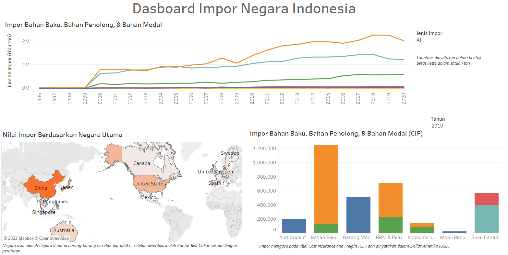
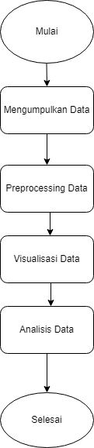
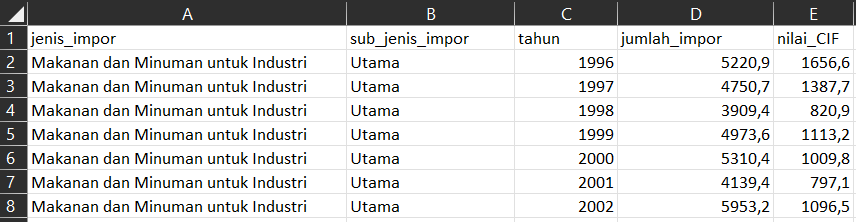
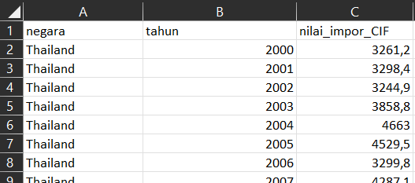
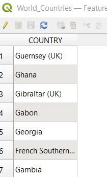
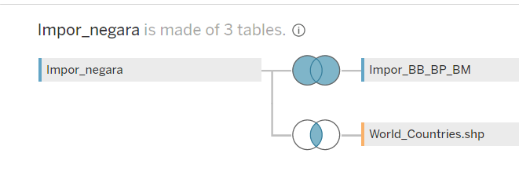

<!--
*** Thanks for checking out the Best-README-Template. If you have a suggestion
*** that would make this better, please fork the repo and create a pull request
*** or simply open an issue with the tag "enhancement".
*** Don't forget to give the project a star!
*** Thanks again! Now go create something AMAZING! :D
-->

<!-- PROJECT SHIELDS -->
<!--
*** I'm using markdown "reference style" links for readability.
*** Reference links are enclosed in brackets [ ] instead of parentheses ( ).
*** See the bottom of this document for the declaration of the reference variables
*** for contributors-url, forks-url, etc. This is an optional, concise syntax you may use.
*** https://www.markdownguide.org/basic-syntax/#reference-style-links
-->

<!-- ABOUT THE PROJECT -->
## Tentang Projek

<!-- [![Product Name Screen Shot][product-dashboard]](https://example.com) -->
<!--  -->

Pada Projek UAS Visualisasi Data, peneliti mengangkat sebuah judul makalah yaitu Implementasi Visualiasi Data Interaktif Kegiatan Impor Bahan Baku, Bahan Penolong, dan Bahan Modal Tahun 1996 - 2020. Adapun tujuan dari penelitiannya sebagai berikut

* Implementasi visualisasi data interaktif pada Data Impor Bahan Baku, Penolong, dan Modal tahun 1996 – 2020.
* Untuk mengetahui hasil eksplorasi apa saja yang didapatkan setelah menerapkan metode implementasi tersebut

Maka dari itu, peneliti membuat tahapan-tahapan dalam pengerjaan implementasi visualisasi data tersebut seperti terlihat pada gambar berikut.

  

(<a href="#top">back to top</a>)

<!-- GETTING STARTED -->
## Mengumpulkan Data 

Data yang digunakan adalah data Impor Bahan Baku (Jumlah Impor dan CIF), Bahan Penolong, Bahan Modal (Jumlah Impor dan CIF), dan Impor beradasarkan negara utama (CIF) yang disatukan dalam file Excel, serta data geospasial negara di dunia dapat dilihat pada gambar berikut

### Impor Bahan Baku, Bahan Penolong, dan Bahan Modal

  

### Impor Berdasarkan Negara Utama 

  

### Data Geospasial Dunia 

  

(<a href="#top">back to top</a>)

<!-- USAGE EXAMPLES -->
## Preprocessing Data

Data tersebut tidak perlu dilakukan Treatment Missing Value karena di masing-masing data tidak ada nilai atau data yang kosong. Kemudian dilakukan Multiple Connections Data yang ada pada Tablue Dekstop yaitu antara Impor Bahan Baku, Bahan Penolong, dan Bahan Modal yang disamakan berdasarkan tahun (full outter join) dengan Impor berdasarkan Negara Utama, dan Impor berdasarkan Negara Utama yang disamakan berdasarkan nama negara (inner join) yang dapat dilihat pada gambar berikut

### Multi Connection Data 

  

(<a href="#top">back to top</a>)

<!-- ROADMAP -->
## Visualisasi Data

Selanjutnya file yang sudah disatukan dibuatkan Dashboard interaktif seperti gambar berikut 

  

komponen diagaram dan jenis visualisasi yang digunakan dalam _Dashboard_ ini sebagai berikut
- Line chart, Digunakan untuk melihat jumlah impor dari tahun ke tahun berdasaraka jenis impor yang bisa diatur dengan filter.
- Stacked Bar, Digunakan untuk melihat perbandingan nilai CIF Impor Bahan Baku, Bahan penolong, dan Bahan Modal berdasarkan tahun yang bisa diatur dengan menggunakan filter.
- Symbol Maps, Digunakan untuk melihat perbandingan nilai CIF berbagai negara utama berdasarkan tahun yang bisa diatur dengan filter. 

(<a href="#top">back to top</a>)

<!-- CONTRIBUTING -->
## Analisis Data
Dimisalkan data 10 tahunan dari 2010 hingga 2020, Negara Cina masih memegang urutan pertama sebagai negara yang paling banyak diimpor, kemudian bahan baku industri olahan masih diurutan pertama baik dari nilai CIF nya maupun jumlah impor.

(<a href="#top">back to top</a>)

<!-- CONTACT -->
## Contact

Rifky Hidayattullah - 221910799 - 3SD2 - 221910799@stis.ac.id

Project Link: [https://public.tableau.com/app/profile/rifky.hidayattullah/viz/UASPROJEK/Dashboard1](https://public.tableau.com/app/profile/rifky.hidayattullah/viz/UASPROJEK/Dashboard1)

(<a href="#top">back to top</a>)

<!-- ACKNOWLEDGMENTS -->
## Acknowledgments

Use this space to list resources you find helpful and would like to give credit to. I've included a few of my favorites to kick things off!

* [Choose an Open Source License](https://choosealicense.com)
* [GitHub Emoji Cheat Sheet](https://www.webpagefx.com/tools/emoji-cheat-sheet)
* [Malven's Flexbox Cheatsheet](https://flexbox.malven.co/)
* [Malven's Grid Cheatsheet](https://grid.malven.co/)
* [Img Shields](https://shields.io)
* [GitHub Pages](https://pages.github.com)
* [Font Awesome](https://fontawesome.com)
* [React Icons](https://react-icons.github.io/react-icons/search)

(<a href="#top">back to top</a>)

<!-- MARKDOWN LINKS & IMAGES -->
<!-- https://www.markdownguide.org/basic-syntax/#reference-style-links -->
[contributors-shield]: https://img.shields.io/github/contributors/othneildrew/Best-README-Template.svg?style=for-the-badge
[contributors-url]: https://github.com/othneildrew/Best-README-Template/graphs/contributors
[forks-shield]: https://img.shields.io/github/forks/othneildrew/Best-README-Template.svg?style=for-the-badge
[forks-url]: https://github.com/othneildrew/Best-README-Template/network/members
[stars-shield]: https://img.shields.io/github/stars/othneildrew/Best-README-Template.svg?style=for-the-badge
[stars-url]: https://github.com/othneildrew/Best-README-Template/stargazers
[issues-shield]: https://img.shields.io/github/issues/othneildrew/Best-README-Template.svg?style=for-the-badge
[issues-url]: https://github.com/othneildrew/Best-README-Template/issues
[license-shield]: https://img.shields.io/github/license/othneildrew/Best-README-Template.svg?style=for-the-badge
[license-url]: https://github.com/othneildrew/Best-README-Template/blob/master/LICENSE.txt
[linkedin-shield]: https://img.shields.io/badge/-LinkedIn-black.svg?style=for-the-badge&logo=linkedin&colorB=555
[linkedin-url]: https://linkedin.com/in/othneildrew
[product-screenshot]: images/screenshot.png
